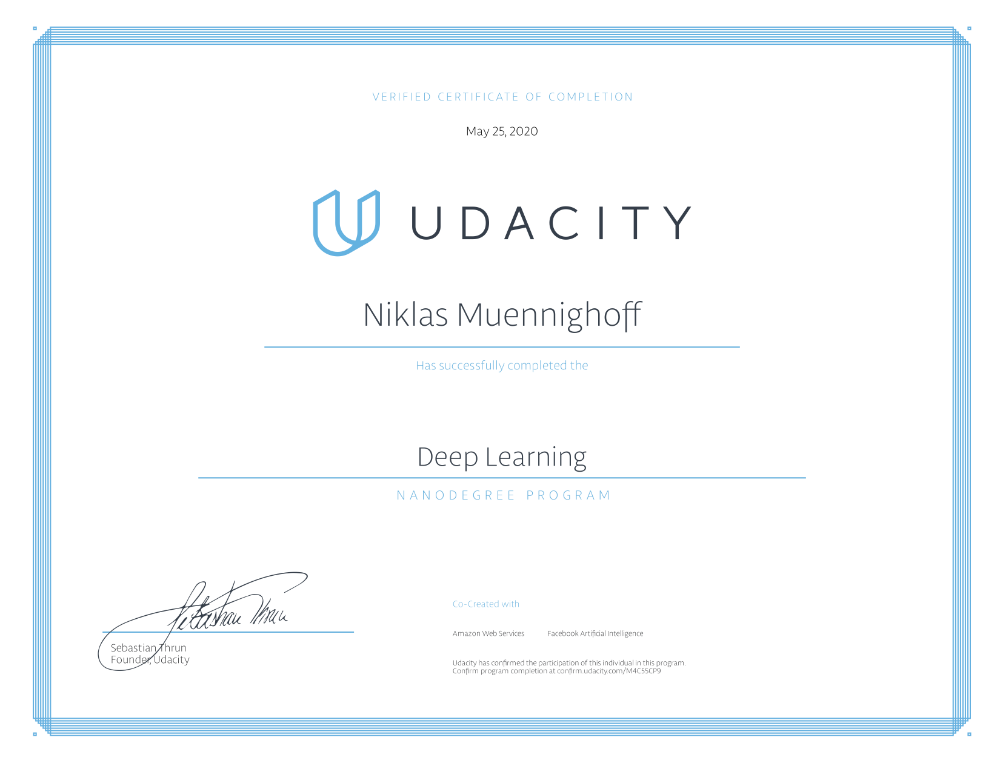

# UdacityDL
Udacity Deep-Learning Nanodegree 2020

Covering the following topics:

- Neural Networks w/ Numpy & Pytorch
- Convolutional Neural Networks
- Recursive Neural Networks
  - Elman Network
  - LSTM Cells
  - Gated Recurent Units
- Generative Adverserial Networks
  - DCGAN
  - Pix2Pix
  - CycleGAN
- AWS SageMaker Deployment

https://www.udacity.com/course/deep-learning-nanodegree--nd101

